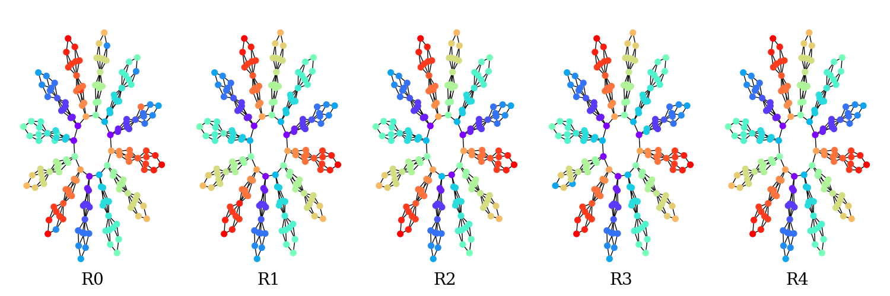

# SUBTREEGL

As my Bachelor Thesis project I created the SUBTREEGL-system build upon the foundation of EEGL (Explanation Enhanced Graph Learning), an iterative method for improving the predictive performance of Graph Neural Networks (GNNs) in node classification  through an Explainable-AI (XAI) based system.

It attempts to further forward the progress in overcoming the mathematically proven constraint of GNNs not being any more powerful in distinguishing non-isomorphic subgraphs than the 1-Weisfeiler-Leman Algorithm. The EEGL-system creatively solves this issue by iteratively enriching the feature vectors of nodes with adjacent subgraph structures found in the explanations for each node within each training run. SUBTREEGL restricts these explanatory subgraphs to trees, a simpler and more computationally efficient structure, in an attempt to decrease runtime across the framework. 

<p align="center">
  
</p>
The iterative refinement of the G180 graph, a graph created out of 1-WL indistinguishable motifs, over five rounds. To vanilla GNNs and the 1-WL algorithm each of the 'branches' of this 180 node graph looks identical, the SUBTREEGL framework correctly classifies them all in R4.

## System Architecture

The framework is built on a modular architecture, with a clear separation between the main experimental workflow, the algorithmic components, and analysis utilities. The core logic is located in the `EEGL/` directory, with advanced algorithmic implementations in the `SUBTREEGL/` directory.

### Core Workflow (`EEGL/`)

The main workflow is orchestrated by the `EEGL` class in `Framework.py` and follows these steps in an iterative cycle:

1.  **GNN Training (`GNN.py`)**: A Graph Convolutional Network (GCN) is trained on the input graph to perform node classification. The model, training loop, and evaluation logic are defined here.

2.  **Explanation Generation (`Explainer.py`)**: The trained GNN's predictions are explained using `torch_geometric.explain.GNNExplainer`. This process generates an "explanation graph" for each node, which is a subgraph of the original graph highlighting the features and structures most important for its prediction.

3.  **Frequent Pattern Extraction (`PatternExtractor.py`)**: The framework mines the collection of explanation graphs to discover frequently occurring subgraph patterns. This is a crucial step that identifies the recurring structural motifs the GNN is using to make its decisions. This module supports multiple mining algorithms:
    *   **Gaston (`Gaston.py`)**: A fast frequent subgraph mining (FSM) algorithm.
    *   **FTM (`SUBTREEGL/FrequentSubtreeMining.py`)**: A custom, highly optimized frequent subtree mining (FSTM) algorithm for when patterns are expected to be tree-like.
    *   **OPM**: An outer-planar miner (not fully integrated).

4.  **Feature Generation (`FeatureGenerator.py`)**: The most frequent and informative patterns discovered in the previous step are used to create new features. For each node in the original graph, the framework checks for the presence of these top patterns in its local neighborhood. The results of these checks form a new set of binary features that are appended to the node's existing feature vector.

5.  **Iteration**: The process repeats. The GNN is retrained with the newly augmented features, leading to potentially better performance and new explanations, which starts the cycle anew.

### Algorithmic Core (`SUBTREEGL/`)

The `SUBTREEGL/` directory contains sophisticated algorithms that support the main workflow, primarily for the FTM (Frequent Tree Mining) pipeline.

*   **`TreeGenerator.py` & `TreeLevelGraph.py`**: These files are used for a powerful pre-computation step. They generate a "level graph" of all non-isomorphic rooted trees up to a specified size. The FTM algorithm traverses this pre-computed space, allowing for efficient pruning and faster discovery of frequent tree patterns.
*   **`FrequentSubtreeMining.py`**: The implementation of the FTM algorithm, which uses the pre-computed level graph to efficiently find frequent subtrees in the explanations.
*   **`SubTreeIsoTester.py` & `GuidanceTree.py`**: A custom subtree isomorphism testing algorithm. It uses a "guidance tree" to decompose the graph, enabling more efficient isomorphism checks than standard methods.
*   **`Glasgow.py`**: A Python wrapper for the high-performance, C++-based Glasgow Subgraph Solver, used for fast subgraph isomorphism testing, which is a critical bottleneck in graph mining.

### Analysis and Execution

*   **`EEGL.py`**: Serves as the main entry point for configuring and launching cross-validation experiments.
*   **`Analysis.py`**: A suite of tools for parsing pickled experiment results, calculating metrics (accuracy, F1-scores, runtimes), and generating plots and LaTeX tables.

## Usage

### Running an Experiment

To run an experiment, configure the parameters within the `runTask` function in `EEGL/EEGL.py` and run the file.

```python
# Inside EEGL/EEGL.py

def runTask(graphName, patternSize, k=None, subgraphMiner='ftm', savePickle=False):
    # ... configuration ...
    # Key parameters to modify:
    # graphName: The name of the graph dataset to use (e.g., 'G180', 'm1').
    # patternSize: The maximum size of patterns to search for.
    # subgraphMiner: The mining algorithm to use ('ftm' or 'gaston').
    # k: The number of top patterns to use for feature generation.
    # ...
    runDict = kFoldCV(...)

if __name__ == '__main__':
    # Example:
    runTask(graphName='G180', patternSize=8, k=10, subgraphMiner='ftm', savePickle=True)
```

### Analyzing Results

The `Analysis.py` script is the primary tool for post-run analysis. It can load pickled result files (`.pkl`) to generate plots and reports.

```python
# Inside EEGL/Analysis.py

if __name__ == '__main__':
    # Example: Load a set of run dictionaries and generate all standard plots and tables.
    # The 'G180all', 'm1all', etc. lists define the experiments to compare.
    loadAndPlot(G180all)

    # Example: Generate confusion matrices for a specific run.
    confusionmatrices('m2FTM', 'PatternSize12', fold=1)
```

## Project Structure

```
.
├── EEGL/
│   ├── EEGL.py               # Main experiment runner
│   ├── Framework.py          # Core EEGL class and workflow orchestration
│   ├── GNN.py                # GCN model definition and training
│   ├── Explainer.py          # Explanation generation
│   ├── PatternExtractor.py   # Interface for different pattern miners
│   ├── FeatureGenerator.py   # New feature generation from patterns
│   ├── SubgraphSolver.py     # Unified interface for isomorphism testing
│   ├── Gaston.py             # Wrapper for the Gaston FSM algorithm
│   ├── Analysis.py           # Script for analyzing experiment results
│   └── data/                 # Data directory for graphs, pickles, etc.
│
├── SUBTREEGL/
│   ├── FrequentSubtreeMining.py # FTM algorithm implementation
│   ├── SubTreeIsoTester.py      # Custom subtree isomorphism algorithm
│   ├── GuidanceTree.py          # Guidance tree generation for the iso-tester
│   ├── TreeLevelGraph.py        # Script to pre-compute the tree level graph
│   ├── TreeGenerator.py         # Generates all non-isomorphic trees
│   ├── Glasgow.py               # Wrapper for the Glasgow subgraph solver
│   └── Visualisation.py         # Visualization utilities
│
└── README.md                 # This file
```

## Dependencies

This project relies on several key Python libraries:

*   `torch`
*   `torch_geometric`
*   `networkx`
*   `numpy`
*   `scikit-learn`
*   `matplotlib`
*   `joblib`
*   `tqdm`

The Glasgow Subgraph Solver is included as an external C++ binary and is called via `subprocess`.
